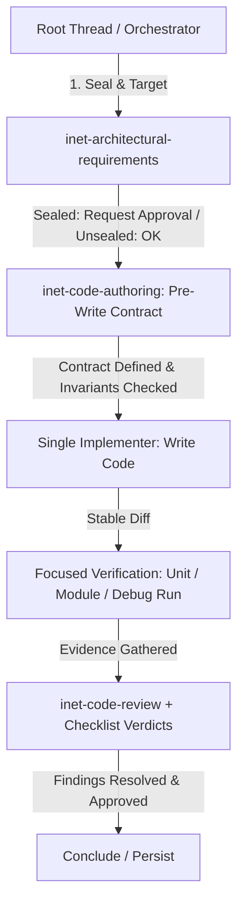

# INET agent orchestration

Keep requirements, decisions, and synthesis in the root thread. Delegate bounded evidence or execution outcomes when independent lanes reduce risk or latency.

## Architecture and Workflow Pipeline



## Constraints

- Keep depth at one; specialists must not delegate.
- Use at most one production-code writer.
- Do not duplicate assignments or delegate work simpler than the handoff.
- Do not let extraction-only agents infer causality, normative meaning, or correctness.
- Stop opening lanes once decisive evidence exists.

## Tiers and agents

| Tier | Appropriate work | Specialist agent |
| --- | --- | --- |
| Chimp 🐒 | Ambiguous standards/MAC/PHY reasoning, difficult runtime causality, final review | `inet-wifi-specialist`, `inet-simulation-detective`, `inet-reviewer` |
| Dog 🐕 | Cross-file architecture and NED/INI tracing | `inet-navigator` |
| Fish 🐟 | Production implementation, established regression and result-analysis workflows | `inet-implementer`, `inet-regression-guard`, `inet-results-analyst` |
| Ant 🐜 | Explicit searches, inventories, filtering, and structured extraction | `inet-evidence-miner` |

For model intelligence ratings, pricing, and active tier assignments, consult [MODELS.md](../../MODELS.md). For platform-specific runner configurations across Codex, Antigravity, and Kimi, see [platform-bindings.md](references/platform-bindings.md).

## Routing

- **Architecture/configuration:** use `inet-navigator`; add `inet-reviewer` for a formal compliance verdict and `inet-wifi-specialist` only when 802.11 semantics matter.
- **Standards/model gap:** use `inet-wifi-specialist`; add `inet-navigator` when the implementation path is broad or unclear.
- **Runtime failure:** lead with `inet-simulation-detective`; add configuration, Wi-Fi, or extraction lanes only for distinct questions.
- **Patch review:** use `inet-reviewer`, which must use `inet-code-review` for every pull request, branch, commit-range, diff, or working-tree review. It additionally uses `inet-architectural-requirements` for `src/inet/` scope. For a formal architecture, naming, or sealing audit without a concrete correctness diff, use the architecture skill as primary and add code review only if correctness review is also requested.
- **Production change:** establish the mechanism and change surface, then assign exactly one `inet-implementer`. For a semantic `src/inet/` change, require the implementer to use `inet-code-authoring` and complete its pre-write implementation contract before the first write. Use `inet-regression-guard` for behavior changes and `inet-reviewer` on the stable verified diff for architecture-sensitive, nontrivial, or 802.11 changes.
- **Results/plots:** use `inet-results-analyst`; use `inet-evidence-miner` only for bounded metadata inventory.

### Trivial Change Fast-Track (Escape Hatch)
For mechanically obvious changes meeting all of the following:
1. Total diff <= 5 lines in a single file;
2. No behavioral contract, protocol state machine, or API signature modified;
3. No sibling dispatch branches or lifecycle interactions affected;
4. Path is unsealed (verified via `check-sealing.sh`);

the orchestrator or implementer may skip formal multi-agent routing and use the lightweight contract flow in `inet-code-authoring`.

## Single-Agent Execution Mode

When executing in a single-agent session without sub-agent delegation, transition through the gates sequentially in the root thread using this checklist:

```text
[ ] 1. Diagnose & Guard: Verify sealing (check-sealing.sh) and confirm mechanism from source/logs.
[ ] 2. Pre-Write Contract: Fill full or lightweight template from inet-code-authoring before modifying files.
[ ] 3. Implement: Make minimal coherent change preserving single ownership and clean lifecycle.
[ ] 4. Focused Verification: Run directly mapped debug-mode tests/simulations with explicit filters.
[ ] 5. Self-Audit & Checklist: Self-audit diff against common-agent-pitfalls.md and emit architecture checklist.
[ ] 6. Conclude: Present stable diff, verified claim, and residual risk.
```

## Assignments and gates

Every delegated prompt must say to follow `AGENTS.md` and the applicable repository skills, not spawn sub-agents, and return to the parent. Specify one deliverable, exact scope and inputs, write authority, exclusions, required evidence, definition of done, and concise return shape. Include paths, symbols, configuration, run/seed, and artifacts when relevant. For semantic `src/inet/` implementation, include the available `inet-code-authoring` contract evidence and require the implementer to complete unresolved items before writing. Reuse a specialist for related follow-up work.

Gate handoffs as follows:

1. Diagnose → implement: demonstrated mechanism, bounded change surface, architecture/seal decision, any required approval, and, for semantic `src/inet/` changes, the available evidence for every `inet-code-authoring` contract field. The implementer completes unresolved fields and directly mapped verification before the first write.
2. Implement → verify: stable diff and explicit behavior claim.
3. Verify → review or conclude: focused debug-mode evidence that exercises the claim; for behavior-affecting production changes, run only the unit, module, and fingerprint tests directly mapped to the changed paths, symbols, or behavioral contracts, using explicit filters and their owning skills. Never run complete or unfiltered suites. When review is required, pass the stable diff, behavior claim, and this evidence to the reviewer.
4. Correctness review → conclude: for changes routed to `inet-reviewer`, all actionable `inet-code-review` findings are confirmed resolved by the same reviewer after focused reverification, or explicitly accepted by the user with the residual risk recorded. Report reviewed scope, validation, and residual risks.
5. Architecture review → conclude: required fitness checks and exact semantic checklist verdicts (including `N/A` for inapplicable rules).
6. Fingerprint update or sealing change: explicit user approval after the evidence is presented.

## Dispute Escalation and Deadlock Resolution

When specialists disagree or findings conflict:

1. **Hierarchy of Truth:**
   `Reproducible runtime/debugger evidence > Packet captures/event logs > Effective INI/NED > Checked-out source > IEEE standard text (for normative requirements) > Agent hypothesis`.
2. **Normative vs. Implementation:** IEEE text governs intended standard behavior; observed simulation runs and source govern INET's actual current implementation. If INET diverges from the standard intentionally, verify against `architecture-exceptions.md` or existing design documentation.
3. **Escalation Protocol:**
   - Define a minimal reproduction (1 node/pair, 1 seed, shortest time) that isolates the contested behavior.
   - Run in debug mode (`MODE=debug`, `opp_run_dbg`) with targeted tracing.
   - The concrete trace or assertion output resolves the finding. If ambiguity persists, record a `QUESTION` for user decision rather than guessing.
