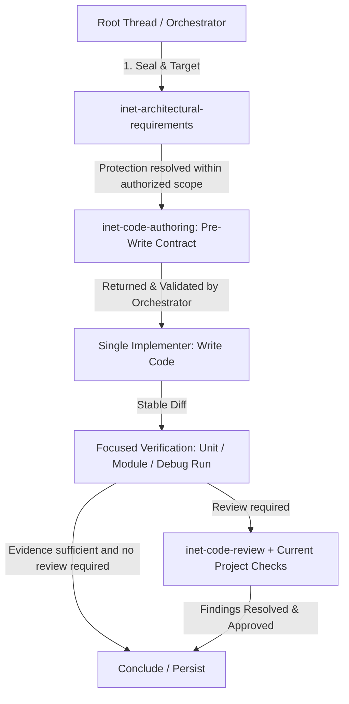

# INET agent orchestration

Keep requirements, decisions, and combined conclusions in the root thread.
Delegate bounded evidence or execution tasks when independent work reduces risk or delay.
An evidence task answers one defined question and returns the facts needed for that answer.

Use [project-guidance-discovery.md](../../references/project-guidance-discovery.md) to obtain the
active checkout's current contribution or review policy and gate order. This skill adds agent
routing, ownership, and handoff mechanics only.

## Execution paths

Use the contract size criteria in `inet-code-authoring`. Choose delegation from unresolved questions and responsibility transfers.

1. **Localized path** — a bounded change with an understood owner, affected callers, and focused verification.
   Keep it in one agent.
   Use the lightweight contract in `inet-code-authoring`.
   Resolve source-protection requirements.
   Run the smallest direct check.
   A behavior change can use this path when its interactions remain clear.
2. **Mechanical path** — a repetitive, behavior-preserving transformation whose invariant can be
   stated before the edit and independently checked afterward. It may span many files. Examples are
   a collision-free rename, a format-preserving migration, or regeneration from an unchanged
   semantic input.
   Use the mechanical-change reference in `inet-code-authoring`.
   Inventory the full scope.
   Check the invariant and generated artifacts.
   Resolve source-protection requirements.
   Run focused verification.
   If the change alters runtime behavior, use the authoring skill's appropriate implementation contract.
3. **Complex or delegated path** — use this path when interacting owners, uncertain behavior, or a specialist handoff needs separate explanation.
   Delegate only when independent evidence or a formal specialist handoff improves the task.
   Otherwise, use the authoring workflow in the root thread.

These paths do not change source protection, verification, or approval requirements. Resolve uncertainty that affects the implementation decision before the dependent edit. Reuse a sufficient plan or contract instead of creating another document.

## Delegated implementation flow

The diagram applies when unresolved design facts require a separate investigation before implementation. A complete, validated assignment can grant write authority at the initial handoff. Use only the review steps required by project guidance or justified by the task's risks.

```mermaid
graph TD
    Root[Root Thread / Orchestrator] -->|1. Seal & Target| ArchGuard[inet-architectural-requirements]
    ArchGuard -->|Protection resolved within authorized scope| Contract[inet-code-authoring: Pre-Write Contract]
    Contract -->|Returned & Validated by Orchestrator| Implement[Single Implementer: Write Code]
    Implement -->|Stable Diff| Test[Focused Verification: Unit / Module / Debug Run]
    Test -->|Review required| Review[inet-code-review + Current Project Checks]
    Test -->|Evidence sufficient and no review required| Conclude[Conclude / Persist]
    Review -->|Findings Resolved & Approved| Conclude[Conclude / Persist]
```

## Constraints

- Keep depth at one; specialists must not delegate.
- Use at most one production-code writer.
- Do not duplicate assignments or delegate work simpler than the handoff.
- Do not let extraction-only agents infer causality, normative meaning, or correctness.
- Stop new evidence tasks once decisive evidence exists.

Use an evidence budget that can change with the task, rather than a fixed invocation or token limit.
Start with the smallest set of tasks that can answer the unresolved questions.
Each task prompt must state its question and the evidence expected to resolve it.
Run required independent tasks in parallel.
For contingent tasks, inspect the prerequisite evidence first.
Run each contingent task only when that evidence shows it is necessary.

Before a new task, reuse a suitable active specialist where possible.
Otherwise, explain why the existing evidence cannot answer the question.

## Specialist classes

| Class | Appropriate work | Specialist agent |
| --- | --- | --- |
| Reasoning | Ambiguous standards/MAC/PHY reasoning, difficult runtime causality, final review | `inet-wifi-specialist`, `inet-simulation-detective`, `inet-reviewer` |
| Navigation | Cross-file architecture and NED/INI tracing | `inet-navigator` |
| Implementation | Production implementation, established regression and result-analysis workflows | `inet-implementer`, `inet-regression-guard`, `inet-results-analyst` |
| Extraction | Explicit searches, inventories, filtering, and structured extraction | `inet-evidence-miner` |

Select the model tier by specialist class under [MODELS.md](../../../MODELS.md):

1. Use the first tier for reasoning.
2. Use the second tier for navigation.
3. Use the third tier for implementation and extraction.

Use [platform-bindings.md](references/platform-bindings.md) for the Codex, Antigravity, and Kimi runner configurations.

## Routing

- **Architecture/configuration:** Use `inet-navigator`.
  Add `inet-reviewer` for a formal compliance verdict.
  Add `inet-wifi-specialist` only when 802.11 semantics matter.
- **Standards/model gap:** Use `inet-wifi-specialist`.
  Add `inet-navigator` when the implementation path is broad or unclear.
- **Runtime failure:** Assign the investigation to `inet-simulation-detective`.
  Add configuration, Wi-Fi, or extraction tasks only for distinct questions.
- **Patch review:** Use `inet-reviewer`.
  The reviewer must use `inet-code-review` for every pull request, branch, commit-range, diff, or working-tree review.
  The reviewer also uses `inet-architectural-requirements` for `src/inet/` scope.
  For architecture, naming, or sealing audits without a correctness diff, use the architecture skill as primary.
  Add code review only if the task also requests correctness review.
- **Production change:** Establish the mechanism and change scope.
  If implementation needs delegation, assign one `inet-implementer` with explicit write scope and the validated contract.
  Use a separate read-only contract task only when unresolved facts prevent that assignment.
  Validate the returned contract before you authorize the dependent edits.
  Add `inet-regression-guard` when a distinct test task benefits from delegation.
  Use `inet-reviewer` when independent review is required or materially reduces a specific correctness or architecture risk.
- **Results/plots:** Use `inet-results-analyst`.
  Use `inet-evidence-miner` only for a bounded metadata inventory.

For a single-agent path, follow the canonical contribution workflow in the root thread and use
the matching pre-write contract and self-audit from `inet-code-authoring`. Do not activate this
orchestration skill solely to classify or execute such a change.

## Assignments and gates

Every delegated prompt must state these requirements:

- Follow the active repository instructions and applicable skills.
- Do not delegate without authorization.
- Return the result to the parent.

Specify one deliverable, exact scope and inputs, write authority, exclusions, required evidence, completion criteria, and a concise response format.
Include paths, symbols, configuration, run/seed, and artifacts when relevant.
When design facts remain unresolved, provide the available authoring evidence in a read-only assignment. The implementer returns the resolved contract and self-validation. The orchestrator validates that result before a follow-up grants write authority. When the initial assignment already supplies a validated contract and write authority, no separate approval turn is necessary. Reuse that implementer for the authorized implementation and related follow-up work.

For implementation, regression, and extraction assignments, include the applicable skill sections and the concrete evidence to return.
A model choice or high reasoning effort does not replace contract checks.
Apply these role requirements:

- The implementer loads the selected authoring references.
- The regression agent identifies the failure path that the test exercises.
- The extractor reports empty or ambiguous selections without a pass conclusion.

Keep causal and normative judgments with the specialist classes assigned those responsibilities above.

Gate handoffs as follows:

1. Diagnose → contract: demonstrated mechanism, bounded change surface, architecture/seal decision, any required approval, and the available evidence for every applicable `inet-code-authoring` contract field.
2. Contract → implement: the assignment contains sufficient design evidence and explicit write authority.
   The implementer checks that evidence against the current tree before the first edit.
   If a separate contract task was necessary, the orchestrator validates its result before authorization.
   An unresolved design fact blocks its dependent edit, not independent authorized work.
3. Implement → verify: stable diff and explicit behavior claim.
4. Verify → review or conclude: evidence selected under the active project guidance and repository
   instructions. When review is required, pass the stable diff, behavior
   claim, contract, implementation report, and evidence to the reviewer.
5. Correctness review → conclude: the same `inet-reviewer` confirms resolution of every actionable `inet-code-review` finding after focused reverification.
   Alternatively, the user explicitly accepts a finding with its residual risk recorded.
   Report reviewed scope, validation, and residual risks.
6. Architecture review → conclude: required fitness checks and the exact semantic verdict format from
   the applicable canonical checklist.
7. Baseline or sealing change: the procedure and authorization required by the active project
   guidance, including any additional approval discovered in repository instructions.

New evidence can invalidate an earlier assumption.
Preserve the working diff and artifacts before a return to the earliest affected check.
Do not use destructive Git reset for recovery.
For a build or focused-test failure, select the next action from its cause:

- If an identified runner or artifact problem caused the failure, remain in verification.
- If the diff caused the failure and the contract remains valid, return to implementation.
- If the mechanism, owner, scope, invariant, or verification mapping is wrong, return to diagnosis and contract definition.

Stop affected edits when evidence invalidates the mechanism or contract.
Revise the affected handoff.
Revalidate it before further implementation.
Reverify every later claim that the correction invalidates.

For example, a hypothetical test fails because its runner loads an old library.
The agent remains in verification to correct the library selection.
If the correct library exposes a wrong owner in the design, the agent returns to diagnosis.

When limited context threatens a safe handoff, save the current state before further work or ownership transfer.
Record these details:

- Current workflow step.
- Verified facts and their evidence.
- Working diff and artifact state.
- Existing approvals.
- Invalidated evidence and unresolved questions.
- Exact next action or command.

Limited context can justify less optional commentary or deferral of contingent tasks.
It never waives source protection, contract checks, focused verification, approval, or required review.

## Dispute Escalation and Deadlock Resolution

When specialists disagree or findings conflict:

1. **Implementation causality:** Match evidence to the disputed claim. A source trace can establish which mutations a complete synchronous path permits. Effective configuration identifies the implementation in use. A runtime trace establishes what occurred in the observed execution, not every supported execution. Reconcile apparent conflicts through the same revision, configuration, loaded artifacts, and observation boundary before you select further checks.
2. **Normative authority:** For claims about required IEEE 802.11 behavior, the applicable standard revision and clause are authoritative. Runtime and source evidence establish whether INET implements that requirement; they cannot override it.
3. **Intentional divergence:** Verify an apparent standards divergence against explicit model documentation, a recorded model limitation, or a user-approved design decision. Architecture and naming exception ledgers govern project structure and naming; do not use them as a standards-deviation ledger.
4. **Resolve the remaining gap:** State which fact remains unknown after source and configuration checks. Use a minimal reproduction or targeted trace only when it can resolve that fact. Select the execution mode from current project guidance. Match the runner and library to the inspected source. Resolve normative ambiguity from the applicable standard text. If intended model behavior remains ambiguous, record a `QUESTION` for user decision.

For example, a hypothetical helper only reads immutable fields and returns without callbacks or suspension. Its complete source path excludes timer-driven mutation during that call. A successful simulation of another branch neither adds to that proof nor disproves a failure on an untested path.
