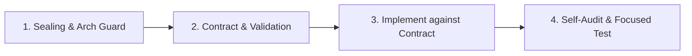

# INET code authoring

Prevent defects while defining and implementing a change. Keep `inet-code-review` independent and read-only; reuse its maintained correctness references without adopting its finding format or reviewer role.

## Implementation Workflow Sequence

Follow this 4-step sequence in order for any change under `src/inet/`:



1. **Sealing Guard:** Run `check-sealing.sh` to confirm target files are unsealed. If sealed, STOP and request explicit permission.
2. **Implementation Contract:** Define and validate the pre-write contract (full or lightweight template) before modifying files.
3. **Implementation:** Code against the contract adhering to modern INET conventions.
4. **Self-Audit & Verification:** Audit stable diff against `common-agent-pitfalls.md` and run directly mapped debug-mode tests.

## Load the preventive checks

Read [common-agent-pitfalls.md](../inet-code-review/references/common-agent-pitfalls.md) for every semantic production change. Select additional layers by the changed runtime contract, not only by file extension, and read every selected reference before editing:

| Layer | Select when the change involves | Preventive checks |
| --- | --- | --- |
| General C++ | APIs, ownership, lifetime, containers, algorithms, callbacks, state, or polymorphism | [general-cpp-review-checks.md](../inet-code-review/references/general-cpp-review-checks.md) |
| OMNeT++ | modules, initialization, events, messages, signals, NED, INI, MSG, statistics, or simulation trajectories | [omnetpp-review-checks.md](../inet-code-review/references/omnetpp-review-checks.md) |
| INET | packets, chunks, tags, protocol integration, lifecycle operations, queues, serializers, feature composition, or INET tests | [inet-review-checks.md](../inet-code-review/references/inet-review-checks.md) |
| IEEE 802.11 | Wi-Fi MAC/PHY behavior, management, association, channel access, Block Ack, capabilities, rates, modes, or configuration | [ieee80211-review-checks.md](../inet-code-review/references/ieee80211-review-checks.md) |

Apply layers cumulatively when a higher-layer behavior relies on lower-layer contracts. For normative IEEE 802.11 behavior, also use `ieee80211-standards` and identify the applicable revision and clause before choosing the implementation.

## Define the implementation contract

Before editing, write a compact working contract or return it in the parent handoff. Use the templates below directly; do not load a worked example unless the contract fields are genuinely unclear.

### Full Contract Template (Default for Semantic Changes)

```text
### Pre-Write Implementation Contract Template
- Invariant & Owner: <intended behavior, preserved invariants, owning class/module>
- Entry Point & Control Path: <effective production caller, entry point, data flow>
- Affected Consumers & Artifacts: <C++, NED, MSG, serializers, registrations, gates>
- Siblings & Terminal Paths: <error, timeout, cancellation, lifecycle STOP/START, retry>
- Boundaries & Units: <identities/TIDs, absolute vs relative time, units, wrap arithmetic>
- Mapped Verification: <smallest direct unit/module/fingerprint test command>
```

### Lightweight Contract Template (Trivial / Bounded Fixes Only)

Use this fast-track template only when the change meets the trivial-change criteria (single file, <= 5 lines, no state-machine/API/lifecycle changes):

```text
### Lightweight Pre-Write Contract
- Target: <file:line>
- Bug / Invariant: <one-line bug description and preserved invariant>
- Change: <exact minimal change to apply>
- Affected Siblings: <confirmation that sibling paths are clean or unshared>
- Direct Verification: <smallest test or build check command>
```

Resolve uncertainty about the mechanism or effective configuration before writing. Do not turn unsupported hypotheses, optional hardening, or unrelated pre-existing issues into patch scope.

### Validate the contract before the first write

Do not start implementation until the contract passes all of these checks:

- Every field contains source- or configuration-backed facts, or a reasoned `N/A`; no `TBD`, placeholder, or unsupported assertion remains.
- The named owner and effective entry/control path were checked in the current tree, and every presently known affected production, generated-input, configuration, registration, documentation, and test path is listed.
- Every named verification command and explicit filter exists, and any command offered as behavioral evidence reaches the claimed behavior. If no direct check exists, record the precise coverage gap and do not represent a build or neighboring test as behavioral proof.
- The contract is internally consistent: its invariant, change surface, siblings, boundary semantics, and verification all describe the same behavior claim.

In single-agent mode, self-validate and record the result before writing. In delegated work, the implementer self-validates before handoff and the parent or orchestrator validates the handoff before authorizing the first write. If a field cannot yet pass, return to discovery instead of weakening the field.

When a filled-in field remains unclear, read the optional [verified non-WLAN contract example](references/example-contract.md). Recheck its paths and facts against the active checkout before adapting it.

## Implement against the contract

- **Modern INET conventions**: use `Packet`, `Chunk`, and `Tag` APIs instead of deprecated `cMessage` encapsulation. `Packet` objects use explicit OMNeT++ ownership transfer through `Packet *`; follow the called API's `take`/`drop`/`send`/delete contract and never place a `Packet` in shared ownership. Chunks and shareable tags use `Ptr`/`makeShared` as their API requires. Use the component's actual lifecycle abstraction—such as `OperationalMixin`'s `handleStartOperation`, `handleStopOperation`, and `handleCrashOperation`, or `ILifecycle::handleOperationStage`—and derive cleanup/restart behavior from that abstraction's contract.
- **Simulation determinism**: use OMNeT++ RNG infrastructure (`getRNG(k)`, `cRNG`) and `simTime()`. When iteration order can affect events, protocol state, selection, or tie-breaking, do not depend on unordered-container order; sort by a stable semantic key first. Never use pointer addresses as behavioral ordering keys, including through ordered pointer-keyed containers such as `std::map<T *, ...>`.
- **Multi-stage initialization**: trace the effective `numInitStages()` through inheritance and identify the highest named initialization stage this class handles. Add or update a local override only when the inherited count does not cover that stage; return a fixed count such as `NUM_INIT_STAGES`, or `std::max(Base::numInitStages(), HIGHEST_STAGE + 1)` when the codebase convention requires preserving a base count. The runtime `stage` parameter is not available inside `numInitStages()`.
- Make the smallest coherent change that updates every affected semantic path and consumer.
- Preserve exactly one owner and disposition across normal, early-return, failure, exception, callback, and teardown paths. Establish externally observable state before re-entrant callbacks or signals, and make shared terminal cleanup idempotent when paths can converge.
- Keep current and pending state, peers, interfaces, flows, TIDs, directions, links, and generations separate according to the owning protocol. Use complete identity tuples and domain-correct boundary or wrap semantics.
- Keep absolute deadlines distinct from relative durations and preserve units and conversion ownership across NED, C++, model fields, serializers, and wire encodings.
- Change generated-code inputs rather than generated outputs, and keep C++, NED, MSG, configuration, registration, serialization, feature, documentation, and test artifacts consistent where the contract requires them.
- Make tests reach the production owner and integration boundary; helper-only coverage does not prove the real caller supplies the right identity or handles every terminal result.

### Handle related scope expansion

When implementation reveals a related target or behavior not covered by the validated contract, pause before modifying that new target. Preserve the current work; do not reset it merely to revisit the contract.

1. Classify the discovery as **required** for the behavior claim or **optional** hardening/follow-up. Keep optional work out of the patch.
2. Add required owners, paths, consumers, sibling/terminal behavior, and any contract deviation to the working contract.
3. Rerun sealing and applicable architecture checks for every newly added target, then remap the smallest direct verification and explicit filters.
4. If the expansion materially exceeds the requested scope, existing authority, or delegated ownership, return the updated contract to the user, parent, or orchestrator before continuing. Otherwise revalidate it and resume.

## Self-audit and hand off

Once the diff is stable, complete this checklist against the implementation contract, `common-agent-pitfalls.md`, and every selected layer reference:

- [ ] Stable diff matches the validated behavior claim; every deviation and required scope expansion is recorded.
- [ ] Effective owner/control path, affected consumers, siblings, and terminal paths were retraced in the resulting tree.
- [ ] Ownership/disposition, reentrancy, lifecycle/state identity, determinism, time/unit/boundary, and generated-input concerns are either checked where applicable or recorded as reasoned `N/A`.
- [ ] All required C++, NED, MSG, INI, serializer, registration, feature, documentation, and test artifacts remain consistent.
- [ ] Focused debug-mode commands use explicit filters, reach the production behavior, and have recorded exit status and artifacts; gaps and fingerprint approval needs are explicit.

Use the owning build, test, simulation, packet, result, and fingerprint skills. Follow `AGENTS.md`: use debug mode and explicit filters, run only directly mapped checks, report a coverage gap instead of broadening the suite, and never update fingerprints without explicit user approval.

Return this plain-text envelope. Use `None` only when supported by the audit; do not omit fields.

```text
### Implementation Report
- Behavior claim: <what the resulting tree now guarantees>
- Changed paths: <complete path list>
- Contract deviations / scope changes: <none, or old -> new scope and authorization>
- Selected layers / high-risk checks: <references and applicable checks completed>
- Focused evidence:
  - Command: <exact command>
  - Working directory: <path>
  - Mode / filter: <debug mode and explicit filter>
  - Exit status: <status>
  - Artifacts: <paths or none>
- Residual risks / coverage gaps: <remaining uncertainty, unrun checks, or none>
```

This self-audit improves the implementation but does not replace an independent `inet-reviewer` when orchestration routes the stable diff to review.
