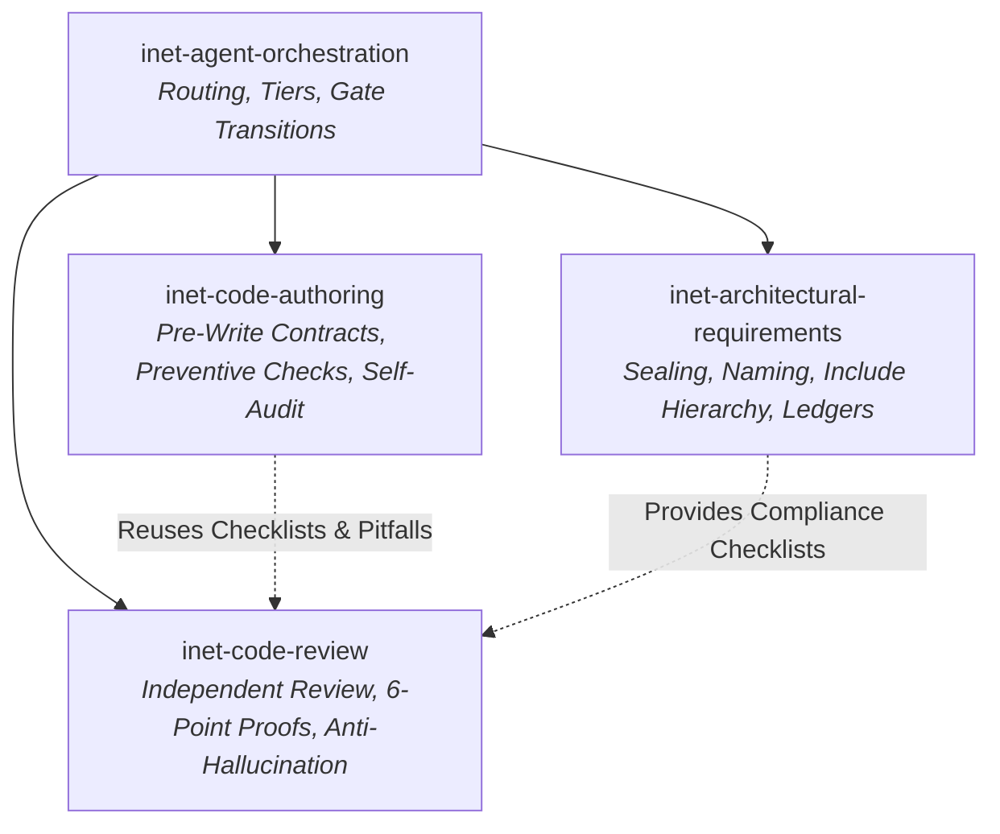

Here is a comprehensive review and critical assessment of the four skills: **`inet-agent-orchestration`**, **`inet-architectural-requirements`**, **`inet-code-authoring`**, and **`inet-code-review`**.

---

### Executive Overview & Design Philosophy

These four skills form a **disciplined engineering lifecycle** tailored specifically to the intricacies of OMNeT++ and INET development. Together, they establish a robust division of responsibilities:



Instead of treating LLM agents as general-purpose autocomplete tools, this suite treats them as specialized engineering roles with strict entry/exit criteria, explicit evidence requirements, and guardrails against common failure modes in discrete-event network simulation.

---

### 1. Skill-by-Skill Evaluation

#### A. `inet-agent-orchestration`
* **Utility**: **Very High** for complex multi-step workflows; **Medium** for single-shot tasks.
* **Effectiveness**:
  * **Strengths**:
    * **Strict Delegation Limits**: Enforcing a maximum delegation depth of 1, a single production-code writer, and forbidding sub-agent delegation eliminates recursion loops and state drift.
    * **Clear Tier Taxonomy (Chimp / Dog / Fish / Ant)**: Explicitly connects cognitive demands (standards ambiguity vs. pattern matching vs. search extraction) to reasoning efforts and roles.
    * **Sequential Gating**: The 6-stage handoff gate (Diagnose $\rightarrow$ Implement $\rightarrow$ Verify $\rightarrow$ Review $\rightarrow$ Conclude) prevents the classic agent mistake of rushing to edit code before understanding the mechanism.
  * **Friction Points / Limitations**:
    * **Model Drift**: Binding specific model strings (e.g., `gemini-3.8-flash`, `kimi-code/k3`) inside `SKILL.md` can become stale when model tiers evolve.
    * **Single-Agent Fallback**: While it excels at routing across specialized agents, it can be slightly heavyweight when an agent runs as a standalone root agent without sub-agent spawning capabilities.

#### B. `inet-architectural-requirements`
* **Utility**: **Critical** for maintaining INET's architectural integrity.
* **Effectiveness**:
  * **Strengths**:
    * **Sealing Guard**: The proactive `doc/project/enforcement/check-source-seals.sh` gate in the active INET checkout, backed by the canonical `doc/project/audit/seal-list.md`, prevents accidental modification of core modules without explicit user authorization.
    * **Ledger Reconciliation**: Codifying known violations and sanctioned exceptions (`AS-*`, `AV-*`, `NS-*`, `NV-*`) prevents agents from hallucinating pre-existing code debt as new errors introduced by a patch.
    * **Automated Tool Integration**: The skill routes the active INET checkout's canonical `doc/project/enforcement/check-architecture.sh` and `doc/project/enforcement/check-ned-msg-naming.py` gates without carrying fallback copies.
    * **Selective Reference Loading**: The change-type routing matrix in the [skill](.agents/skills/inet-architectural-requirements/SKILL.md) selects the relevant canonical rule identifiers without duplicating their text.
  * **Friction Points / Limitations**:
    * Context pressure remains high if an agent ignores the routing matrix and loads full requirement files.

#### C. `inet-code-authoring`
* **Utility**: **High** for implementers and feature designers.
* **Effectiveness**:
  * **Strengths**:
    * **Pre-Write Implementation Contract**: Requiring agents to explicitly identify the invariant owner, control/data paths, semantic sibling paths, terminal cleanup, and mapped tests *before* writing code prevents half-baked diffs.
    * **Targeting LLM Blindspots**: Explicitly checks for omission of sibling paths (e.g., updating data-frame handling while omitting management-frame handling), missing signal emissions on early returns, and lifecycle reset issues (`STOP`/`START`).
    * **Single Source of Truth**: Reuses the check references from `inet-code-review` without duplicate maintenance.
  * **Friction Points / Limitations**:
    * Could benefit from an explicit markdown template to make contract formulation fast and uniform.

#### D. `inet-code-review`
* **Utility**: **Exceptional** — arguably one of the most thoroughly designed reviewer skills.
* **Effectiveness**:
  * **Strengths**:
    * **Strict 6-Point Proof Standard**: Mandating Invariant, Trigger, Mechanism, Consequence, Scope, and Verification kills speculative "nitpicks" and prevents vague LLM critique.
    * **Antidote to Common AI Hallucinations**: [.agents/skills/inet-code-review/references/common-agent-pitfalls.md](.agents/skills/inet-code-review/references/common-agent-pitfalls.md) specifically debunks recurring AI reviewer errors in INET (e.g., confusing long-lived container caches with memory leaks, flagging 12-bit modular sequence number arithmetic as overflow, or misinterpreting shared chunk pointers).
    * **Clean Separation of Findings vs. Checklists**: Correctness findings take precedence and are self-contained; architectural checklists are appended at the end to avoid burying critical bugs in compliance text.
  * **Friction Points / Limitations**:
    * Requires high reasoning effort; low-capability models may struggle to trace multi-layer reachability across OMNeT++ signals and INET chunk hierarchies.

---

### What to Add or Remove

#### 1. Recommended Additions

1. **Explicit Implementation Contract Template in `inet-code-authoring`**:
   Add a standardized, copy-pasteable Markdown block to `SKILL.md` or a reference file:
   ```markdown
   ### Implementation Contract
   - **Target Invariant & Owner**: [Class/Module owning state]
   - **Effective Entry Point**: [Method/Signal triggering the path]
   - **Affected Consumers & Siblings**: [Data, Mgmt, Control, Error paths]
   - **Lifecycle & Boundaries**: [STOP/START, timer cancellations, unit conversions]
   - **Direct Verification**: [Exact unit/test filter command]
   ```
   *Why*: Helps implementers quickly fill out and self-audit the contract before their first write.

2. **Git Diff Resolution Helpers in `inet-code-review`**:
   Add explicit Git command patterns in the target establishment section (e.g., `git diff HEAD`, `git diff origin/master...HEAD`, `git show <commit>`).
   *Why*: Eliminates agent guesswork when locating the narrowest reviewable diff in local feature branches.

3. **Single-Thread Execution Protocol in `inet-agent-orchestration`**:
   Add explicit guidance for when an agent operates without sub-agent tools:
   * "When running in a single-agent context, transition through the phases sequentially (Diagnose $\rightarrow$ Authoring Contract $\rightarrow$ Implement $\rightarrow$ Filtered Test $\rightarrow$ Review Self-Audit) without skipping gates."*

4. **Legacy vs. Modern INET API Guidance in `inet-code-authoring`**:
   Add a short note contrasting deprecated INET patterns with modern requirements (e.g., legacy `cMessage` vs modern `Packet`/`Chunk`/`Tag`, raw pointer passing vs `IntrusivePtr`/`SharedPtr`).

---

#### 2. Recommended Removals / Simplifications

1. **Decouple Specific Model Names from `inet-agent-orchestration/SKILL.md`**:
   Move the specific model string tables (`gemini-3.8-flash`, `kimi-code/k3`) out of `SKILL.md` into [MODELS.md](MODELS.md) or delegate to the runtime configuration.
   *Why*: Model names change frequently across IDE versions and platforms, causing skill instructions to quickly become outdated.
2. **Trim Redundant Sealing Text in `inet-code-authoring`**:
   `inet-code-authoring` contains repetitive warnings regarding sealing approval. A single reference pointing to `inet-architectural-requirements` for sealing is sufficient and saves token budget.

---

### Summary Verdict

| Skill | Rating | Primary Value |
| :--- | :---: | :--- |
| **`inet-agent-orchestration`** | **9/10** | Prevents uncoordinated subagent spawning and enforces structured gate handoffs. |
| **`inet-architectural-requirements`** | **9.5/10** | Guards against core breakage, include creep, and false-positive architectural warnings. |
| **`inet-code-authoring`** | **9/10** | Forces pre-commit invariant reasoning and prevents partial sibling implementations. |
| **`inet-code-review`** | **10/10** | Outstanding anti-hallucination guardrails and strict proof standards for simulation code. |

**Overall**: This 4-skill ecosystem is exceptionally well thought out, addressing the exact operational weaknesses of LLMs when dealing with complex, deterministic C++/OMNeT++ simulation codebases. Incorporating the minor template and workflow refinements above will make it even more seamless.
